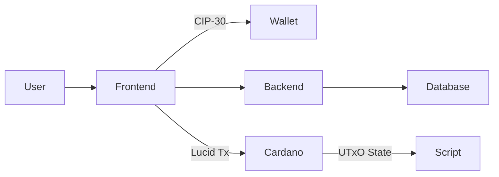
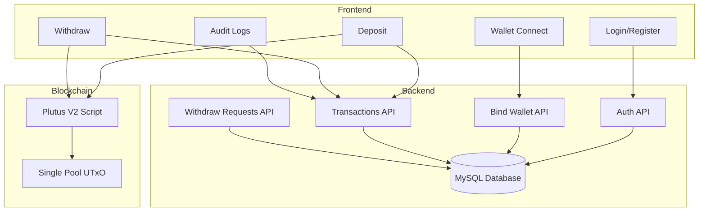
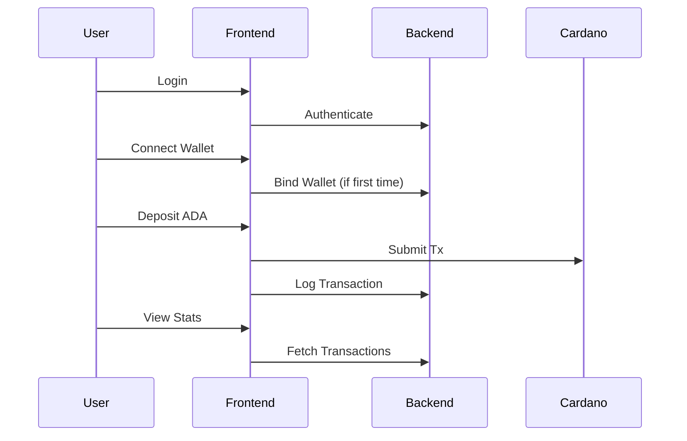

# Commvault – Community Savings Pool (Cardano dApp)

A decentralized community treasury built on **Cardano**, powered by a **Plutus V2 smart contract**, with wallet binding, role-based controls, audit transparency, and a single-UTxO pool model.

---

# 📚 Table of Contents

1. [Overview](#overview)
2. [Problem It Solves](#problem-it-solves)
3. [Core Features](#core-features)
4. [System Architecture](#system-architecture)
5. [On-Chain Design](#on-chain-design)
6. [Off-Chain & Backend Design](#off-chain--backend-design)
7. [Database Structure](#database-structure)
8. [User Roles](#user-roles)
9. [Application Flow](#application-flow)
10. [Wallet Binding Logic](#wallet-binding-logic)
11. [Single UTxO Model Explained](#single-utxo-model-explained)
12. [Installation & Setup](#installation--setup)
13. [How To Use The App](#how-to-use-the-app)
14. [Security Considerations](#security-considerations)
15. [Future Improvements](#future-improvements)

---

# Overview

CommVault is a decentralized savings pool that allows:

* Community members to deposit ADA into a shared treasury
* A designated Treasurer to execute withdrawals
* Transparent transaction history & audit tracking
* Secure wallet binding per registered user
* Role-based access for treasury operations

Built using:

* **Plutus V2** (Smart Contract)
* **Lucid** (Off-chain Tx Builder)
* **PHP + MySQL** (Backend APIs)
* **Vanilla JS + HTML/CSS** (Frontend)
* **Cardano Lace Wallet (CIP-30)**

---

# Problem It Solves

Traditional community funds suffer from:

* Lack of transparency
* Manual bookkeeping
* Risk of fund mismanagement
* No cryptographic enforcement of roles

CommVault solves this by:

* Locking funds in a smart contract
* Enforcing treasurer-only withdrawals on-chain
* Logging all transactions in backend DB
* Binding wallets to user accounts
* Providing audit lookup by wallet

---

# Core Features

✅ Wallet binding (1 wallet per registered user)
✅ Single-UTxO treasury model
✅ Deposit & Withdraw via Plutus contract
✅ Treasurer dashboard
✅ Withdrawal request approval system
✅ Audit log by wallet address
✅ Modal-based wallet notifications
✅ Rate-limited login & registration
✅ Backend transaction tracking

---

# System Architecture

## High-Level Architecture



---

## Detailed Architecture



---

# On-Chain Design

## Smart Contract Logic

* **Deposit**

  * Must preserve treasurer datum
  * Must not decrease script value
  * Must keep exactly ONE continuing output

* **Withdraw**

  * Must be signed by treasurer
  * Must preserve datum
  * May close pool OR recreate single UTxO

---

# Single UTxO Model Explained

Instead of creating multiple UTxOs:

❌ Old behavior:

```
Deposit 1 → UTxO #1
Deposit 2 → UTxO #2
Deposit 3 → UTxO #3
```

✅ New behavior:

```
UTxO #0 (100 ADA)
Deposit 20 → consume #0 → recreate #0 (120 ADA)
Deposit 10 → consume #0 → recreate #0 (130 ADA)
```

All operations always use index `0`.

Benefits:

* Easier accounting
* Predictable treasury state
* Simpler withdrawals
* Cleaner audit logic

---

# Off-Chain & Backend Design

## Off-Chain (Lucid)

* Connect wallet
* Enforce wallet binding
* Build transactions
* Select script UTxO index 0
* Merge deposits into single UTxO

## Backend APIs

* `/auth/login.php`
* `/auth/register.php`
* `/api/users/bind_wallet.php`
* `/api/transactions/log.php`
* `/api/withdraw_requests/*`
* `/api/stats.php`

---

# Database Structure

### users

* id
* email
* password_hash
* wallet_address
* wallet_bound_at
* is_active
* created_at

### pool_transactions

* id
* user_id
* pool_id
* tx_type
* amount_lovelace
* onchain_tx_hash
* status
* created_at

### withdrawal_requests

* id
* user_id
* pool_id
* full_name
* amount_ada
* recipient_address
* status
* created_at

---

# User Roles

### Member

* Register
* Connect wallet
* Deposit ADA
* Submit withdrawal request
* View transaction history

### Treasurer

* Connect registered treasurer wallet
* Execute withdrawals
* Approve withdrawal requests
* Audit members by wallet address

---

# Wallet Binding Logic

1. User logs in
2. Connects wallet
3. If first time:

   * Wallet is bound in DB
4. If wallet mismatch:

   * Access denied
5. If wallet already used by another account:

   * Registration blocked

---

# Application Flow



---

# Installation & Setup

## 1. Install Ubuntu (WSL)

```
wsl --install -d Ubuntu
```

## 2. Clone Repository

```
git clone <repo-url>
cd community-pool
```

## 3. Install Haskell Dependencies

```
cabal update
cabal build
```

## 4. Start PHP Server

```
php -S localhost:8000
```

## 5. Open in Browser

```
http://localhost:8000
```

---

# How To Use The App

## For Members

1. Register account
2. Login
3. Connect wallet
4. First connection auto-binds wallet
5. Enter deposit amount
6. Confirm in wallet
7. View updated stats

## For Treasurer

1. Login with treasurer account
2. Connect registered treasurer wallet
3. View withdrawal requests
4. Execute withdrawal
5. Confirm transaction in wallet

## For Audit

1. Go to Audit Logs page
2. Paste wallet address
3. View:

   * User details
   * Total deposits
   * Withdrawal history

---

# Security Considerations

* Password hashing via `password_hash()`
* CSRF token validation
* Rate limiting login/register
* Wallet binding enforcement
* Single-UTxO model
* On-chain treasurer signature enforcement
* Prepared statements for SQL queries

---

# Future Improvements

* Multi-sig treasurer
* Governance voting
* NFT membership badges
* CIP-68 metadata support
* Treasury analytics dashboard
* Mobile wallet optimization
* Auto-indexer integration
* IPFS document storage

---

# Summary

Commvault is a full-stack decentralized treasury platform that:

* Enforces trust via smart contracts
* Provides transparency via audit logs
* Prevents wallet spoofing
* Uses a clean single-UTxO treasury design
* Separates roles securely

It demonstrates a real-world blockchain treasury system suitable for:

* Community savings groups
* DAOs
* Clubs
* Cooperatives
* Microfinance pools

---

